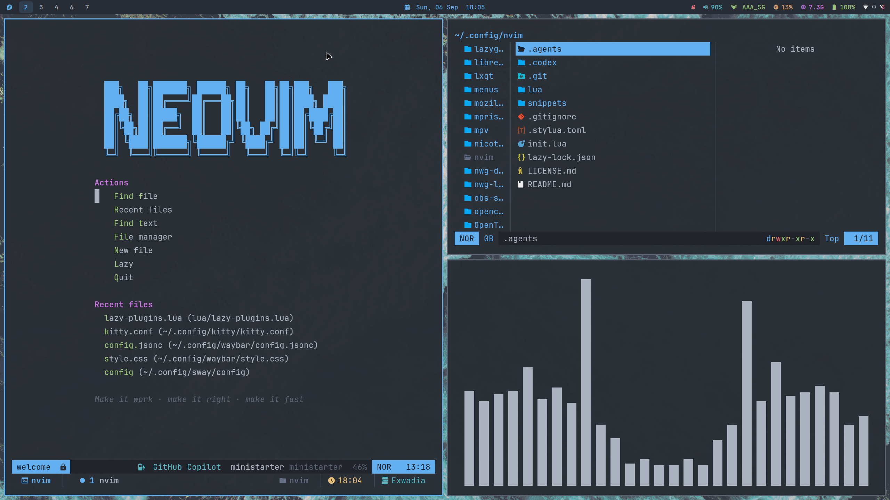
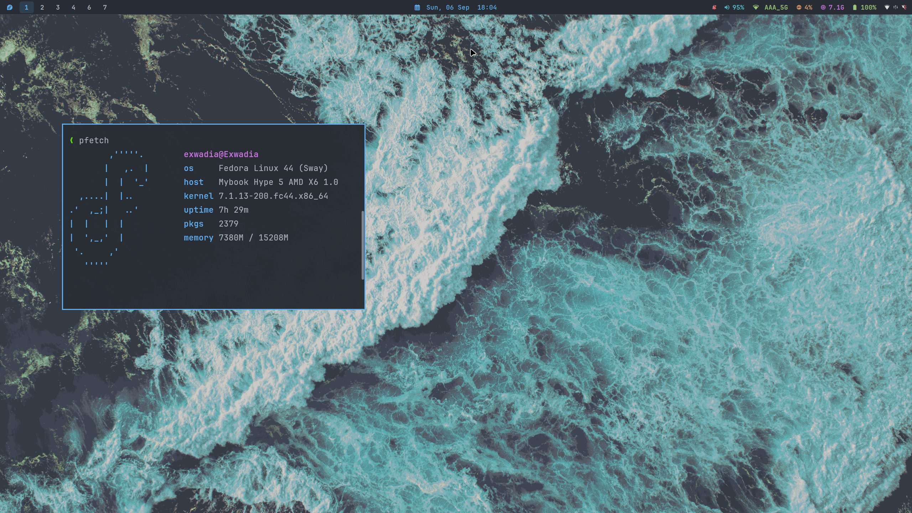
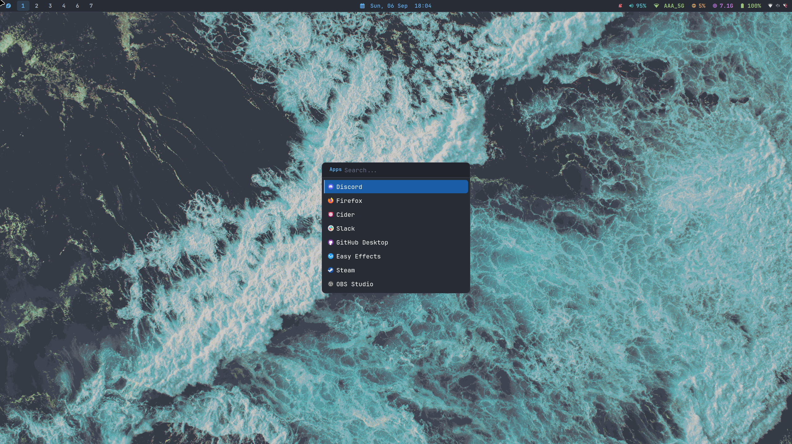

# Sway Config

A simple personal configuration for a Sway desktop, including Waybar, Rofi,
Kitty, Kanshi, Yazi, and Fish.

## Desktop Showcase







## Included

- Sway keybindings, gaps, window rules, idle locking, and screenshot tools
- Waybar with workspaces, clock, volume, CPU, memory, battery, and tray modules
- Rofi application launcher with custom themes
- Kitty terminal with a Nord-inspired color scheme
- Kanshi profiles for laptop and external monitor layouts
- Yazi file manager theme and configuration
- Fish shell aliases and a tmux sessionizer script
- Volume controls with desktop notifications

## Requirements

Install Sway and the tools referenced by the configuration:

```text
sway waybar rofi-wayland kitty kanshi swayidle gtklock swaync
grim slurp wayfreeze wl-clipboard imagemagick brightnessctl
pulseaudio-utils network-manager-applet pavucontrol thunar libnotify
fish eza yazi tmux fzf
```

Package names may differ between Linux distributions. A JetBrainsMono Nerd Font
and the Papirus icon theme are also recommended.

## Installation

Clone the repository, then move the configuration files into `~/.config`:

```sh
git clone <repository-url> ~/sway-config

mkdir -p ~/.config/fish ~/.local/bin

mv ~/sway-config/sway ~/.config/sway
mv ~/sway-config/waybar ~/.config/waybar
mv ~/sway-config/rofi ~/.config/rofi
mv ~/sway-config/kitty ~/.config/kitty
mv ~/sway-config/kanshi ~/.config/kanshi
mv ~/sway-config/yazi ~/.config/yazi
mv ~/sway-config/config.fish ~/.config/fish/config.fish
mv ~/sway-config/tmux-sessionizer ~/.local/bin/tmux-sessionizer
```

Back up or remove existing files at those locations before moving the configs.

## Customization

Before using the configuration, review these machine-specific settings:

- Update the hard-coded volume helper path in `sway/config` if your username or
  config location is different.
- Adjust the output names, resolutions, and positions in `sway/outputs` and
  `kanshi/config` for your monitors. Use `swaymsg -t get_outputs` to find them.
- Update the wallpaper path in `sway/config`.
- Review the application-to-workspace rules in `sway/config`.

Reload Sway with `Super+Shift+C` after making changes.

## Main Shortcuts

| Shortcut | Action |
| --- | --- |
| `Super+Enter` | Open Kitty |
| `Super+R` | Open Rofi |
| `Super+E` | Open Thunar |
| `Super+Q` | Close the focused window |
| `Super+1-0` | Switch workspace |
| `Super+Shift+1-0` | Move a window to a workspace |
| `Super+Shift+S` | Copy a region screenshot |
| `Super+Ctrl+Shift+S` | Save and copy a region screenshot |
| `Super+Shift+P` | Pick a screen color |
| `Super+Ctrl+L` | Lock the screen |
| `Super+F` | Toggle fullscreen |
| `Super+Shift+Space` | Toggle floating mode |
